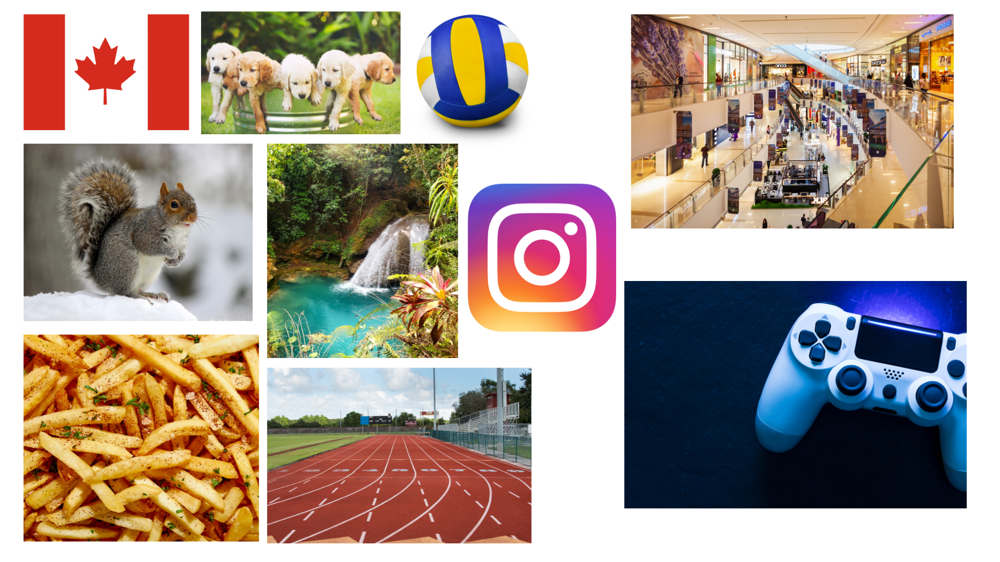

# zara_markdown
Dear Mr Aiello,

My name is Zara Morrison and im in 10th grade. I am so excited to take your class this year and I am ready to finally gain a better understanding of computer science since I barely understand it even now. 

I dont often watch movies but i do watch series. My favorite show is the rookie. A new/recent skill i learned is probably something tumbling related since i dont think ive learned anything new after quitting. One of my personal achievements would be keeping all As throughout all of middle school and so far all of high school. A fun fact about me is that im originally from canada and i moved here just in the middle to end of covid. The most recent sports ive played are volleyball, track, and cheer. Before that i think ive played or tried out almost all of them.

Some things i like to do in my free time are bake or do some kind of craft. Usually i stick to food related activities because i like trying new recipes, but on occasion i paint or bedazzle or draw.Over summer, I volunteered at a cultural festival in toronto called **Caribana**. In my opinion i definitely worked over 100 hours across two weeks but it was fun regardless. In my family, we always make sure to switch houses on christmas and because a majority of my immediate family are content creators, we always make some kind of christmas video whether its a music video or reality tv inspired. My favoritesummer memory is going back to canada to see all my childhood friends. In the future, I hope to pursue a career where i can help people while being able to work remotely, meaning i can <u>travel and work from *wherever i am*.

([Playlist](https://music.apple.com/us/playlist/comp-sci-markup/pl.u-aZb0kgvT14WXDZm))